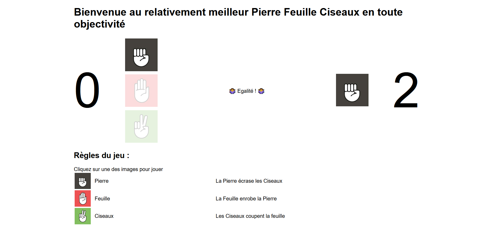
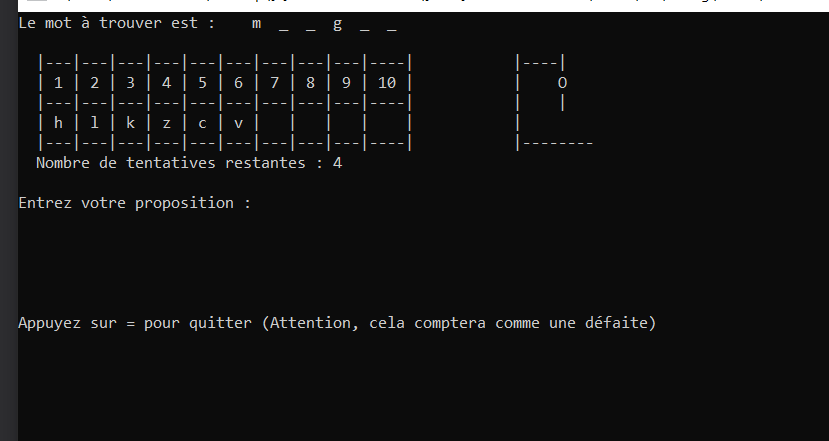

# Exo_10 : Fonctions
## 1) Jeu de Pierre - Feuille - Ciseaux
* Exemple de rendu :

* Instructions :
```
Le joeur selectionne une des trois images. On génère un nombre aléatoire pour savoir si l'ordinateur a joué pierre feuille ou ciseaux, le point est accordé au gagnant de la manche. Le premier à 3 manches gagnantes gagne le point.
Bonus : Affichez le score de toutes les parties gagnées de chacun (vous + ordi)
Bonus du bonus : Sauvegardez les parties gagnées de chacun pour qu'on ai toujours les résultats en revenant sur la page (voir localStorage) 
```

## 2) Jeu du pendu
* Attentes fonctionnalités :

* Instructions :
```
    - Le programme selectionne un mot aléatoirement dans une liste de mots
    - Grâce à un input et un button, le joueur peut proposer une lettre
    - Si la lettre est dans le mot, on la dévoile (mise à jour de l'affichage du mot)
    - Si la lettre n'est pas dans le mot, une erreur est comptée (le pendu s'affiche de plus en plus pendu)
    - Si la lettre a déjà été proposée (on est gentils), on indique à l'utilisateur que c'est le cas et on ne compte pas d'erreur
    - On veut pouvoir voir la liste des lettres déjà proposées
    
    ** Bonus : Pouvoir faire plusieurs parties (compter les victoires et les défaites), pouvoir revenir au menu à tout instant (défaite), après avoir fait une partie, le mot est dégagé de la liste de mots
```