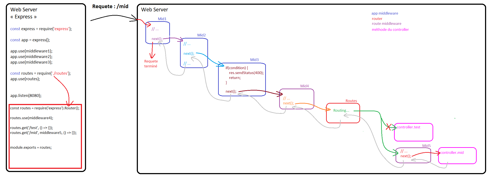
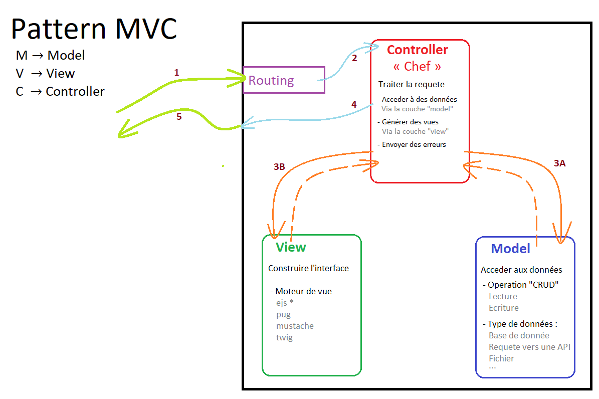

# Demo 02

## Rappel sur les middlewares
Ensemble de fonctions "chainées" qui vont s'executer après une requete

## Pattern MVC
Schema de fonctionnement du pattern MVC

- Séparation de responsabilité
  - Model : Acceder au Data
  - View : Génération du visuel
  - Controller : Traiter la requete
- Maintenabilité plus simple

