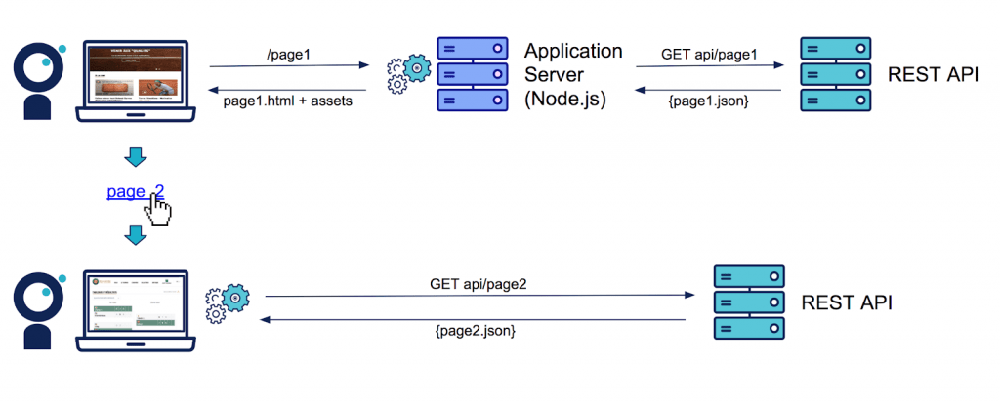
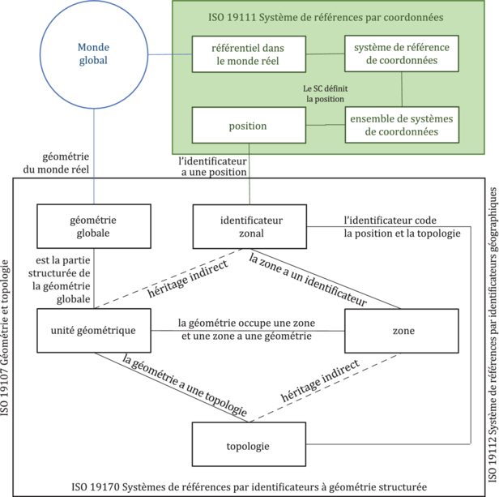

# NextJS

## Description 

Framework React -> Serveur isomorphique (En grod: Mix server backend + Client frontend)

NB: Le schema ne représente pas le fonctionnement de NextJS

## Objectif
 - Meilleur reférencement (SEO)
 - Application plus léger pour le client
 - Pages pré-rendues (HTML généré + JS injecté)

## Next Page VS Next App
Page 
- Pré-rendu des pages (SSG / SSR / CSR / ISR)
        - SSG : Static Site Generation ↝ getStaticProp 
        - SSR : Server-Side Rendering, service side rendering ↝ getServerSideProps
        - client side rendering
        - ISR : Incremental Static Regeneration
- Injection du JS
- Proxy API intégré
- Fonctionnalités React : 
        - Utilisation des hooks
        - Mise en place de Redux identique
- Routing 
        - Dossier "page"
        - Uniquement les composants dans le dossier accessibles

App 
 - Pré-rendu des pages avec :
    - Composant Serveur
    - Composant Client
 - Injection uniquement du JS des cmposant Client
 - Proxy API intégré
 - Possibilité de faire de la logique "Backend" dans les composants serveur
    - Appel DB
    - Variable privé (Clef API)
    - Le composant est exécuter côté serveur et le rendu est envoyé au client
 - Fonctionnalité React : 
    - Utilisation des hooks limité uniquement au composant client
    - Utilisation des events du DOM limité au composant client
    - Mise en place particuliers de Redux (Accessible par les composants client mais pas serveur)
 - Routing 
        - Dossier "app"
        - Uniquement les composants nommé "page" dans le dossier qui sont accessibles